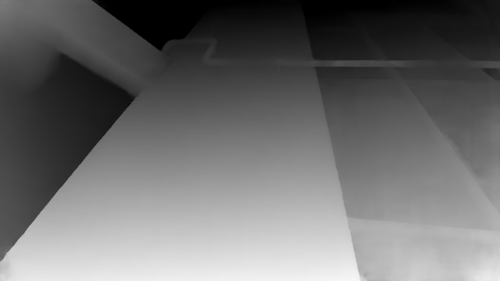
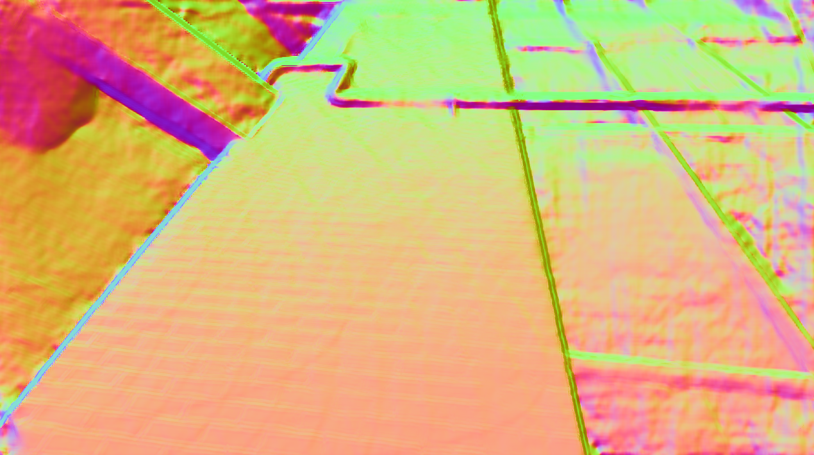
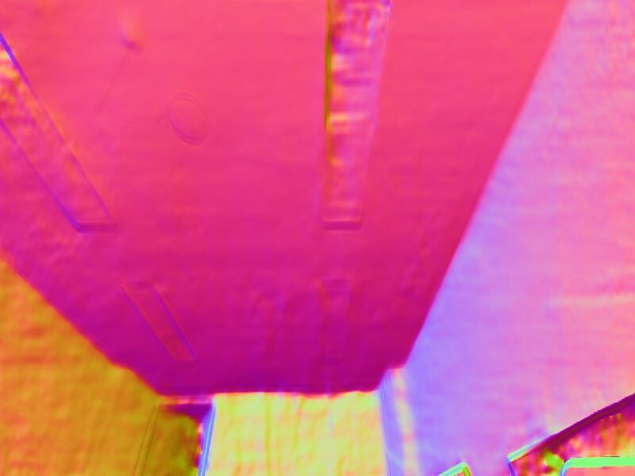
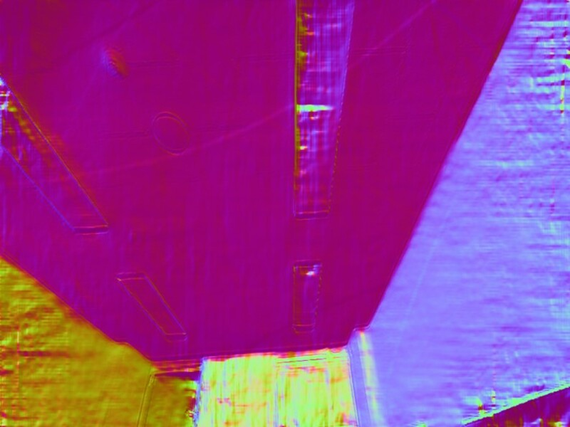

# PlaneFill

PlaneFill is a algorithm to detect multiple planes from depth image

We inspired by [this page](https://stackoverflow.com/questions/34644101/calculate-surface-normals-from-depth-image-using-neighboring-pixels-cross-produc).

# Algorithm

First, compute $\partial D/\partial u$ and $\partial D/\partial v$ from depth images. In depth image, $u$ and $v$ axes are orthogonal to each other. Thus, we can simply calculate normal vector from $\partial D/\partial u$ and $\partial D/\partial v$
$$ \mathbf{n}(u,v) =
    \begin{bmatrix} 1 \\ 0 \\ \frac{\partial D}{\partial u} \end{bmatrix} \times \begin{bmatrix} 0 \\ 1 \\ \frac{\partial D}{\partial v} \end{bmatrix} =
    \begin{bmatrix}
        -\frac{\partial D}{\partial u} \\ -\frac{\partial D}{\partial v} \\ 1
    \end{bmatrix} $$

Then we can get these results.
| Depth Image             |  Normal Map |
:-------------------------:|:-------------------------:
  |  

But, we can't find plane from this normal map due to normal vectors appear in different values depending on the depth even though they are on the same plane.
This is because we calculate normal vector on the normalized camera coordinate. Thus, these vectors do not reflect the actual characteristics of the plane and instead represent distorted values.  

We predicted that this phenomenon would worsen as the distance increased, so we thought that we could interpolate using these values. (This is an abstract approach, and we are currently conducting research for a more mathematical interpretation.)

Thus, we modified $\mathbf{n}$ to compensate distortion.
$$\mathbf{\bar{n}}(u,v) = \alpha {\mathbf{k}} * \mathbf{n} = \begin{bmatrix} -\frac{\partial D}{\partial x} & -\frac{\partial D}{\partial y} & \alpha \end{bmatrix}^\top $$
$$\bar{\alpha}(u,v) = \frac{\bar{D}(u,v)}{\max\bar{D}(u',v')}, \bar{D}(u,v) = D(u,v) - \min D(u',v')$$

Then, we can acquire filtered-normal map

Then we can get these results.
| Common Approach ($\alpha = 1$)         |  Proposed Approach |
:-------------------------:|:-------------------------:
  |  

Next, we proceeded with plane labeling using the previously obtained normal map. For labeling, we utilized the flood-fill algorithm from OpenCV to perform pixel growing on the plane.  
While using flood-fill, we found that the pixel growing method occasionally results in the merging of different planes. Therefore, we employed a method that utilizes not only the comparison with surrounding pixel values but also incorporates the absolute difference values from the seed point.   
(For now, we select seed points uniformly, but we are conducting research to determine a more efficient number and location of seed points.)

# Test Result
